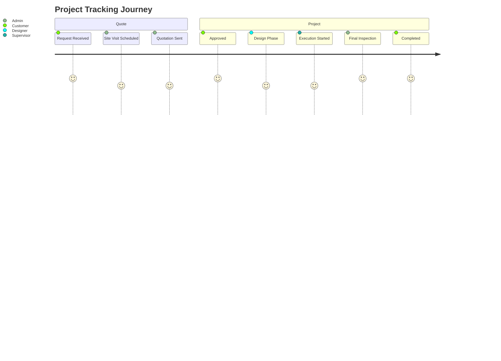
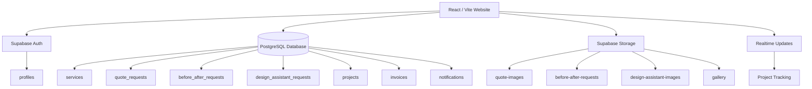
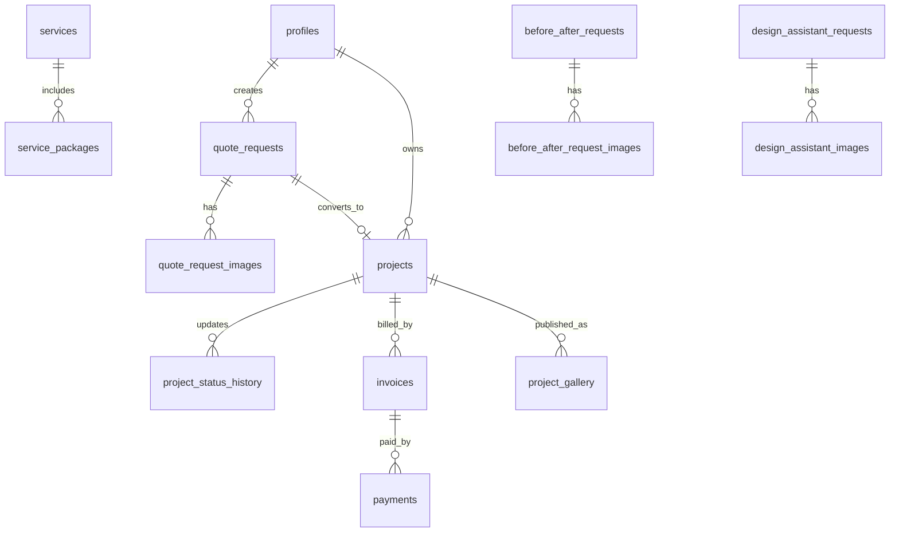
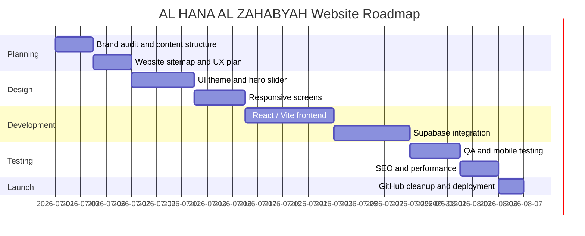

<!--
AL HANA AL ZAHABYAH — DESIGN & DECORATION WORKS
Ultra Luxury GitHub README
Prepared by Sadek Elgazar
-->

<div align="center">


# 🟡 AL HANA AL ZAHABYAH
## Design & Decoration Works

### Luxury Interior Design • Home Paint • Decoration • Renovation • UAE

<br/>


<br/>
<br/>

> **A premium digital platform for a UAE-based design and decoration company. Built to present luxury services, capture quote requests, manage projects, showcase before/after transformations, and prepare the business for full Supabase-powered operations.**

<br/>

[🌐 Website](https://www.alhanaalzahabyah.com) •
[📩 Admin Email](mailto:admin@alhanaalzahabyah.com) •
[💬 WhatsApp](https://wa.me/971555587699) •
[🧾 Request Quote](#-request-quote-system) •
[🛠 Admin Dashboard](#-admin-dashboard)

</div>

---

<div dir="rtl">

# ✦ نبذة فاخرة عن المشروع

**AL HANA AL ZAHABYAH — Design & Decoration Works** هي منصة رقمية احترافية لشركة تعمل في مجال **التصميم الداخلي، الدهانات، الديكور، وتجديد المنازل والفلل والمشاريع التجارية داخل الإمارات**.

الهدف ليس إنشاء موقع تعريفي عادي، بل بناء **واجهة رقمية فاخرة** تعكس جودة أعمال الشركة، وتحول الزائر إلى عميل محتمل، ثم تسمح لاحقًا بإدارة الطلبات والمشاريع والفواتير والصور والتحديثات عبر **Supabase**.

</div>

---

# 🧭 Table of Contents

- [Visual Identity](#-visual-identity)
- [Premium Visual Assets Library](#-premium-visual-assets-library)
- [Project Core Information](#-project-core-information)
- [Core Services](#-core-services)
- [Website Pages](#-website-pages)
- [Homepage Experience](#-homepage-experience)
- [Customer Journey](#-customer-journey)
- [Request Quote System](#-request-quote-system)
- [Before / After Service](#-before--after-service)
- [AI Design Assistant](#-ai-design-assistant)
- [Admin Dashboard](#-admin-dashboard)
- [Supabase Architecture](#-supabase-architecture)
- [Database Schema](#-database-schema)
- [Tech Stack](#-tech-stack)
- [Folder Structure](#-folder-structure)
- [Installation](#-installation)
- [SEO Strategy](#-seo-strategy)
- [Quality Checklist](#-quality-checklist)
- [Contact & Social Channels](#-contact--social-channels)
- [Prepared By](#-prepared-by)

---

# ✨ Visual Identity

<div align="center">

<table>
<tr>
<td align="center" width="20%"><h3>⚫ Deep Black</h3><code>#070707</code></td>
<td align="center" width="20%"><h3>⬛ Charcoal</h3><code>#151515</code></td>
<td align="center" width="20%"><h3>🟡 Luxury Gold</h3><code>#D4AF37</code></td>
<td align="center" width="20%"><h3>🟤 Bronze Gold</h3><code>#A97924</code></td>
<td align="center" width="20%"><h3>⚪ Ivory</h3><code>#F8F5ED</code></td>
</tr>
</table>

</div>

<div dir="rtl">

| العنصر | التوجيه البصري |
|---|---|
| الهوية | فاخرة، سوداء وذهبية، راقية، مخصصة لشركة تصميم وديكور |
| الخطوط | عربية واضحة وفاخرة + إنجليزية نظيفة مثل Inter / Poppins / Playfair Display |
| الحركة | انتقالات ناعمة، ظهور تدريجي، Hover ذهبي، صور قبل/بعد |
| الخلفيات | Charcoal, marble texture, architectural line art, glass cards |
| الصور | فلل، مجالس، صالات، غرف، مطابخ، قبل/بعد، مخططات هندسية |
| التجربة | سريعة، ثنائية اللغة، متجاوبة، مريحة، وتدفع العميل لطلب عرض سعر |

</div>

---

# ✨ Premium Visual Assets Library

<div align="center">

> **A curated black-and-gold cinematic visual system prepared for AL HANA AL ZAHABYAH.**  
> These 10 premium images are designed for hero sliders, service banners, before/after sections, AI design assistant pages, gallery covers, contact pages, service pages, and luxury UI backgrounds.  
> **Click any image to open the full-resolution asset.**

<br/>


</div>

<br/>

<div align="center">

<table>
<tr>
<td width="50%" align="center">
<a href="https://i.postimg.cc/NjvQZ2dd/1.png" target="_blank" rel="noopener noreferrer">

</a><br/>
<b>01 — Luxury Lounge Hero</b><br/>
<sub>Homepage Hero • Interior Design • Main Brand Visual</sub>
</td>
<td width="50%" align="center">
<a href="https://i.postimg.cc/T3jTx2sB/2.png" target="_blank" rel="noopener noreferrer">

</a><br/>
<b>02 — Luxury Villa Exterior</b><br/>
<sub>Villa Renovation • Premium Exterior • Architectural Presence</sub>
</td>
</tr>

<tr>
<td width="50%" align="center">
<a href="https://i.postimg.cc/dVRJFQXP/3.png" target="_blank" rel="noopener noreferrer">

</a><br/>
<b>03 — Arabian Majlis Interior</b><br/>
<sub>Home Decoration • Majlis Design • Arabian Luxury</sub>
</td>
<td width="50%" align="center">
<a href="https://i.postimg.cc/kgN7CMHk/4.png" target="_blank" rel="noopener noreferrer">

</a><br/>
<b>04 — Luxury Bedroom</b><br/>
<sub>Home Design • Bedroom Design • Hotel-Inspired Mood</sub>
</td>
</tr>

<tr>
<td width="50%" align="center">
<a href="https://i.postimg.cc/rwGqTyb6/5.png" target="_blank" rel="noopener noreferrer">

</a><br/>
<b>05 — Luxury Kitchen & Dining</b><br/>
<sub>Home Renovation • Kitchen Upgrade • Dining Experience</sub>
</td>
<td width="50%" align="center">
<a href="https://i.postimg.cc/FHbhvFq9/6.png" target="_blank" rel="noopener noreferrer">

</a><br/>
<b>06 — Luxury Office / Reception</b><br/>
<sub>Commercial Decoration • Offices • Contact / Corporate Pages</sub>
</td>
</tr>

<tr>
<td width="50%" align="center">
<a href="https://i.postimg.cc/T3jTx2S2/7.png" target="_blank" rel="noopener noreferrer">

</a><br/>
<b>07 — Commercial Showroom / Boutique</b><br/>
<sub>Commercial Projects • Retail Design • Showroom Experience</sub>
</td>
<td width="50%" align="center">
<a href="https://i.postimg.cc/jS6RTq92/8.png" target="_blank" rel="noopener noreferrer">

</a><br/>
<b>08 — Before / After Transformation</b><br/>
<sub>Before / After Page • Transformation Service • Renovation Concept</sub>
</td>
</tr>

<tr>
<td width="50%" align="center">
<a href="https://i.postimg.cc/g2yGpc5n/9.png" target="_blank" rel="noopener noreferrer">

</a><br/>
<b>09 — AI Design Assistant</b><br/>
<sub>AI Design Assistant • Smart Planning • Architectural Overlay</sub>
</td>
<td width="50%" align="center">
<a href="https://i.postimg.cc/cL7dW1jv/10.png" target="_blank" rel="noopener noreferrer">

</a><br/>
<b>10 — Design Moodboard / Materials</b><br/>
<sub>Materials • Moodboard • Design Process • Brand Presentation</sub>
</td>
</tr>
</table>

</div>

---

## 🎞️ Hero Slider Visual Mapping

| Image | Visual Name | Recommended Usage | Route |
|---|---|---|---|
| 01 | Luxury Lounge Hero | Homepage main hero / Home Design | `/` + `/services/home-design` |
| 02 | Luxury Villa Exterior | Villa Renovation hero | `/services/villa-renovation` |
| 03 | Arabian Majlis Interior | Home Decoration / Majlis design | `/services/home-decoration` |
| 04 | Luxury Bedroom | Bedroom design / Home Design | `/services/home-design` |
| 05 | Luxury Kitchen & Dining | Home Renovation / Kitchen upgrade | `/services/home-renovation` |
| 06 | Luxury Office / Reception | Contact / Commercial office | `/contact` + `/services/commercial-decoration` |
| 07 | Commercial Showroom | Commercial decoration / Gallery | `/services/commercial-decoration` |
| 08 | Before / After Transformation | Before/After service page | `/before-after` |
| 09 | AI Design Assistant | Smart design assistant | `/design-assistant` |
| 10 | Design Moodboard | Materials / process / about | `/about` + `/services` |

<details>
<summary><b>🔗 Direct Image URLs</b></summary>

| Image | Direct URL |
|---|---|
| 01 | `https://i.postimg.cc/NjvQZ2dd/1.png` |
| 02 | `https://i.postimg.cc/T3jTx2sB/2.png` |
| 03 | `https://i.postimg.cc/dVRJFQXP/3.png` |
| 04 | `https://i.postimg.cc/kgN7CMHk/4.png` |
| 05 | `https://i.postimg.cc/rwGqTyb6/5.png` |
| 06 | `https://i.postimg.cc/FHbhvFq9/6.png` |
| 07 | `https://i.postimg.cc/T3jTx2S2/7.png` |
| 08 | `https://i.postimg.cc/jS6RTq92/8.png` |
| 09 | `https://i.postimg.cc/g2yGpc5n/9.png` |
| 10 | `https://i.postimg.cc/cL7dW1jv/10.png` |

</details>

---

<details>
<summary><b>🧠 Developer Notes for UI Integration</b></summary>

```ts
export const premiumHeroImages = [
  { id: "luxury-lounge", title: "Luxury Lounge Hero", image: "https://i.postimg.cc/NjvQZ2dd/1.png", route: "/", usage: "Homepage hero slider, home design, premium brand intro" },
  { id: "villa-exterior", title: "Luxury Villa Exterior", image: "https://i.postimg.cc/T3jTx2sB/2.png", route: "/services/villa-renovation", usage: "Villa renovation hero and exterior design sections" },
  { id: "arabian-majlis", title: "Arabian Majlis Interior", image: "https://i.postimg.cc/dVRJFQXP/3.png", route: "/services/home-decoration", usage: "Majlis, decoration, Arabesque luxury interiors" },
  { id: "luxury-bedroom", title: "Luxury Bedroom", image: "https://i.postimg.cc/kgN7CMHk/4.png", route: "/services/home-design", usage: "Bedroom design and home design banners" },
  { id: "kitchen-dining", title: "Luxury Kitchen & Dining", image: "https://i.postimg.cc/rwGqTyb6/5.png", route: "/services/home-renovation", usage: "Kitchen renovation and dining space transformation" },
  { id: "office-reception", title: "Luxury Office / Reception", image: "https://i.postimg.cc/FHbhvFq9/6.png", route: "/contact", usage: "Commercial office, reception, contact page background" },
  { id: "commercial-showroom", title: "Commercial Showroom / Boutique", image: "https://i.postimg.cc/T3jTx2S2/7.png", route: "/services/commercial-decoration", usage: "Retail, boutique, showroom, commercial decoration" },
  { id: "before-after-transformation", title: "Before / After Transformation", image: "https://i.postimg.cc/jS6RTq92/8.png", route: "/before-after", usage: "Before/after transformation service" },
  { id: "ai-design-assistant", title: "AI Design Assistant", image: "https://i.postimg.cc/g2yGpc5n/9.png", route: "/design-assistant", usage: "AI design assistant and smart planning sections" },
  { id: "materials-moodboard", title: "Design Moodboard / Materials", image: "https://i.postimg.cc/cL7dW1jv/10.png", route: "/about", usage: "Moodboard, materials, design process, about page" },
];
```

</details>

---

## 🏆 Visual Direction

<div align="center">

<table>
<tr>
<td align="center">
<h3>⚫ Black Marble</h3>
<p>Deep cinematic backgrounds with premium texture.</p>
</td>
<td align="center">
<h3>🟡 Gold Lighting</h3>
<p>Warm luxury lighting, trims, borders, and CTA glow.</p>
</td>
<td align="center">
<h3>🏛 Architecture</h3>
<p>Line-art, arches, UAE luxury villa and interior language.</p>
</td>
</tr>
<tr>
<td align="center">
<h3>🛋 Interior Luxury</h3>
<p>Majlis, bedrooms, kitchens, lounges, offices, and showrooms.</p>
</td>
<td align="center">
<h3>🧠 Smart Design</h3>
<p>AI-ready visuals for future interactive design experience.</p>
</td>
<td align="center">
<h3>🔁 Transformation</h3>
<p>Before/after visual storytelling for conversion-focused pages.</p>
</td>
</tr>
</table>

</div>

<div align="center">

### ✦ These visuals should power the full website experience ✦

**Homepage Slider • Service Headers • Before/After • AI Assistant • Gallery • Contact • About • Commercial Projects**

</div>

---

# 📌 Project Core Information

| Field | Details |
|---|---|
| **Company Name** | AL HANA AL ZAHABYAH |
| **Arabic Brand** | الهنا الذهبية للتصميم وأعمال الديكور |
| **Business Field** | Design & Decoration Works |
| **Country / Market** | United Arab Emirates |
| **Official Website** | `www.alhanaalzahabyah.com` |
| **Admin Email** | `admin@alhanaalzahabyah.com` |
| **Phone / WhatsApp** | `+971555587699` |
| **WhatsApp Link** | `https://wa.me/971555587699` |
| **Logo** | `https://i.postimg.cc/KzbRXw4k/11zon-cropped.png` |
| **Prepared By** | Sadek Elgazar |
| **Status** | Website build-ready, Supabase-ready, GitHub-ready |

---

# 🛋 Core Services

<div align="center">

<table>
<tr>
<td align="center" width="25%"><h2>🏠</h2><h3>Home Design</h3><p>Elegant residential interior concepts for villas, apartments, majlis rooms, bedrooms, kitchens, and full home layouts.</p></td>
<td align="center" width="25%"><h2>🎨</h2><h3>Home Paint</h3><p>Premium wall finishing, decorative paint, exterior paint, accent walls, texture finishes, and refined color planning.</p></td>
<td align="center" width="25%"><h2>🪞</h2><h3>Home Decoration</h3><p>Luxury decorative styling, gypsum works, lighting concepts, wall panels, curtains, furniture mood, and final detailing.</p></td>
<td align="center" width="25%"><h2>🛠</h2><h3>Home Renovation</h3><p>Full home improvement, villa renovation, kitchen and bathroom upgrades, flooring, ceiling, lighting, and finishing works.</p></td>
</tr>
</table>

</div>

<div dir="rtl">

## خدمات موسعة داخل الموقع

| القسم | الخدمات |
|---|---|
| التصميم الداخلي | تصميم فلل، شقق، مجالس، غرف نوم، مكاتب، صالات |
| الدهانات | دهانات داخلية، خارجية، ديكورية، ورق جدران، Texture Paint |
| الديكور | جبس بورد، إضاءات، ألواح جدارية، ستائر، مرايا، إكسسوارات |
| التجديد | مطابخ، حمامات، أرضيات، أسقف، واجهات، تحسين شامل |
| المشاريع التجارية | مكاتب، محلات، مطاعم، صالونات، معارض |
| الاستشارات | زيارة موقع، قياس، اقتراحات، تصور مبدئي، عرض سعر |
| إدارة المشروع | متابعة مراحل التنفيذ، صور قبل/بعد، تقارير إنجاز |

</div>

---

# 🌐 Website Pages

| Page | Route | Purpose |
|---|---|---|
| 🏛 Home | `/` | Hero slider, services, why us, gallery, CTA |
| 👑 About Us | `/about` | Story, mission, values, quality promise |
| 🛋 Services | `/services` | Service cards, benefits, process |
| 🏠 Home Design | `/services/home-design` | Villas, apartments, majlis, bedrooms |
| 🎨 Home Paint | `/services/home-paint` | Internal/external paint, textures |
| 🪞 Home Decoration | `/services/home-decoration` | Gypsum, lighting, panels, styling |
| 🛠 Home Renovation | `/services/home-renovation` | Kitchen, bathroom, flooring, lighting |
| 🏛 Villa Renovation | `/services/villa-renovation` | Facades, majlis, exterior, complete upgrade |
| 🏢 Commercial Decoration | `/services/commercial-decoration` | Offices, shops, restaurants, salons |
| 🖼 Gallery | `/gallery` | Before/after, filters, categories |
| 🔁 Before / After | `/before-after` | Slider, upload images, smart suggestion |
| 🧠 AI Design Assistant | `/design-assistant` | Style, upload, mood, recommendation |
| 🧾 Request Quote | `/request-quote` | Form, images upload, service selector |
| 📍 Track Project | `/track-project` | Project number, progress, status |
| 👤 Customer Portal | `/customer-portal` | Requests, projects, invoices |
| 🛠 Admin Dashboard | `/admin-portal` | KPIs, requests, projects, invoices |
| 📩 Contact Us | `/contact` | WhatsApp, email, map, form |
| ❔ FAQs | `/faqs` | Services, pricing, visits, timeline |
| 📰 Blog | `/blog` | Design tips, renovation guides |

---

# 🎬 Homepage Experience

<div dir="rtl">

الصفحة الرئيسية يجب أن تبدأ بسلايدر سينمائي فاخر يستخدم الصور العشر، مع نصوص متغيرة حسب الصورة والخدمة.

**العنوان الرئيسي:** `نحو فضاءات راقية تعكس رؤيتك`  
**النص:** `تصميم وديكور وتنفيذ فاخر للمنازل والفلل والمساحات التجارية داخل الإمارات.`

**الأزرار:**  
`اطلب عرض سعر` • `شاهد أعمالنا` • `تواصل عبر واتساب`

</div>

```txt
┌──────────────────────────────────────────────────────────────────────────────┐
│  Dark text area                         Luxury black-and-gold image visual   │
│                                                                              │
│  AL HANA AL ZAHABYAH                                                          │
│  نحو فضاءات راقية تعكس رؤيتك                                                  │
│  تصميم وديكور وتنفيذ فاخر داخل الإمارات                                      │
│                                                                              │
│  [اطلب عرض سعر] [شاهد أعمالنا] [واتساب]                                      │
│                                                                              │
│  Dots • Progress Bar • Thumbnail Rail • Smooth Cinematic Fade                 │
└──────────────────────────────────────────────────────────────────────────────┘
```

---

# 🧑‍💼 Customer Journey


---

# 🧾 Request Quote System

| Field | Type | Notes |
|---|---|---|
| Full Name / الاسم الكامل | Text | Required |
| Phone / رقم الهاتف | Phone | Required |
| Email / البريد الإلكتروني | Email | Optional |
| Emirate / الإمارة | Select | UAE Emirates |
| Area / المنطقة | Text | Required |
| Property Type / نوع العقار | Select | Villa, Apartment, Office, Shop, Restaurant, Salon |
| Service Type / نوع الخدمة | Multi Select | Design, Paint, Decoration, Renovation |
| Budget Range / الميزانية | Select | Optional |
| Preferred Date / موعد المعاينة | Date | Optional |
| Description / وصف المشروع | Textarea | Required |
| Images / صور المكان | File Upload | Multiple images |
| Consent / الموافقة | Checkbox | Required |

**After submit:** generate `AHZ-2026-0001`, notify admin, save images to Supabase Storage later, and allow tracking.

---

# 🔁 Before / After Service

Route: `/before-after`

A real transformation service, not just a gallery.

Required features:
- Hero using Image 08.
- Interactive before/after slider.
- Category filters.
- Transformation cards.
- Upload space images.
- Smart transformation suggestion.
- Request similar transformation CTA.
- WhatsApp and phone CTA.
- Supabase-ready tables: `before_after_projects`, `before_after_requests`, `before_after_request_images`.

---

# 🧠 AI Design Assistant

Route: `/design-assistant`

A future-ready smart design experience.

Steps:
1. Select project type.
2. Select design style.
3. Select colors and mood.
4. Upload space images.
5. Receive initial smart direction.
6. Submit request to team.

Future integration:
- Supabase Storage for uploaded images.
- `design_assistant_requests` table.
- Optional AI image analysis.
- Admin dashboard review.

---

# 📍 Project Tracking



| Status | Arabic Display |
|---|---|
| `new` | تم استلام الطلب |
| `contacted` | تم التواصل مع العميل |
| `site_visit_scheduled` | تم تحديد موعد المعاينة |
| `quote_sent` | تم إرسال عرض السعر |
| `approved` | تم اعتماد المشروع |
| `design_phase` | مرحلة التصميم |
| `execution_started` | بدأ التنفيذ |
| `inspection` | المعاينة النهائية |
| `completed` | تم التسليم |

---

# 🛠 Admin Dashboard

| Section | Function |
|---|---|
| Overview | Statistics, new requests, active projects |
| Quote Requests | Manage quotation requests |
| Appointments | Schedule site visits |
| Before / After Requests | Review transformation photo requests |
| AI Design Requests | Review smart assistant submissions |
| Projects | Create projects and update progress |
| Project Updates | Upload phase updates and images |
| Gallery | Publish projects |
| Customers | Manage customer data |
| Invoices | Create and track invoices |
| Settings | Website and business settings |

---

# 👤 Customer Portal

| Section | Purpose |
|---|---|
| My Requests | Quote and transformation requests |
| My Projects | Active and completed projects |
| Project Progress | Timeline and updates |
| Invoices | Billing and payment status |
| Uploaded Files | Photos, designs, documents |
| Support | Contact company support |

---

# 🏗 Supabase Architecture



---

# 🧬 Database Schema



---

# 🗂 Storage Buckets

| Bucket | Purpose |
|---|---|
| `avatars` | User profile images |
| `quote-images` | Quote request images |
| `before-after-projects` | Public before/after project images |
| `before-after-requests` | Client uploaded before/after request images |
| `design-assistant-images` | AI design assistant uploaded images |
| `project-before` | Before execution photos |
| `project-after` | After execution photos |
| `project-updates` | Project progress photos |
| `gallery` | Public gallery images |
| `invoices` | Invoice PDFs |
| `design-files` | Design files, PDFs, 3D, CAD |

---

# 🧪 Tech Stack

<div align="center">


</div>

| Layer | Recommended Tools |
|---|---|
| Frontend | React, Vite, TypeScript |
| Styling | Tailwind CSS, CSS variables |
| Animation | Framer Motion |
| Icons | Lucide React |
| Forms | React Hook Form + Zod |
| Backend | Supabase |
| Database | PostgreSQL |
| Deployment | Vercel / Netlify |
| Version Control | GitHub |

---

# 📁 Folder Structure

```bash
al-hana-al-zahabyah/
├── public/
│   ├── logo.png
│   ├── favicon.png
│   └── og-image.jpg
├── src/
│   ├── components/
│   │   ├── common/
│   │   ├── layout/
│   │   ├── hero/
│   │   ├── before-after/
│   │   ├── assistant/
│   │   └── dashboard/
│   ├── pages/
│   ├── lib/
│   ├── data/
│   │   ├── heroSlides.ts
│   │   ├── premiumHeroImages.ts
│   │   ├── services.ts
│   │   ├── beforeAfterProjects.ts
│   │   └── faqs.ts
│   ├── hooks/
│   ├── styles/
│   └── main.tsx
├── supabase/
│   ├── migrations/
│   ├── seed.sql
│   └── policies.sql
├── README.md
├── package.json
├── tailwind.config.ts
├── vite.config.ts
└── .env.example
```

---

# ⚙️ Environment Variables

```env
VITE_SUPABASE_URL=
VITE_SUPABASE_ANON_KEY=
VITE_SITE_URL=https://www.alhanaalzahabyah.com
VITE_ADMIN_EMAIL=admin@alhanaalzahabyah.com
VITE_WHATSAPP_NUMBER=+971555587699
VITE_COMPANY_NAME=AL HANA AL ZAHABYAH
```

---

# 🚀 Installation

```bash
git clone https://github.com/YOUR_USERNAME/al-hana-al-zahabyah.git
cd al-hana-al-zahabyah
npm install
npm run dev
npm run build
npm run preview
```

---

# 🔐 Roles & Permissions

| Role | Permissions |
|---|---|
| Customer | طلب عرض سعر، رفع صور، متابعة المشروع، رؤية الفواتير |
| Admin | إدارة كاملة لكل النظام |
| Designer | متابعة المشاريع المسندة ورفع تصاميم |
| Supervisor | تحديث حالة التنفيذ ورفع صور الموقع |
| Accountant | إدارة الفواتير والمدفوعات |

---

# 🔍 SEO Strategy

<div dir="rtl">

## كلمات مفتاحية مقترحة

- شركة تصميم داخلي في الإمارات
- ديكور منازل الإمارات
- تجديد فلل دبي
- دهانات منازل أبوظبي
- تصميم مجالس فاخرة
- شركة ديكور في دبي
- تصميم داخلي فلل الإمارات
- أعمال جبس بورد الإمارات
- Home renovation UAE
- Interior design UAE
- Villa decoration Dubai
- Luxury interior design Abu Dhabi

</div>

| Page | SEO Title |
|---|---|
| Home | Luxury Design & Decoration Works in UAE |
| Home Design | Interior Design Services for Villas & Homes in UAE |
| Home Paint | Premium Home Painting Services in UAE |
| Home Decoration | Home Decoration & Gypsum Works in UAE |
| Before / After | Before & After Interior Design Transformations |
| AI Design Assistant | AI Design Assistant for Interior Design Projects |

---

# ⚡ Performance Strategy

- Preload only the first hero image.
- Lazy-load remaining hero images.
- Use `decoding="async"` for images.
- Use React lazy routes.
- Avoid heavy carousel libraries.
- Use CSS transitions for slider effects.
- Respect `prefers-reduced-motion`.
- Avoid layout shift with fixed hero dimensions.
- Use safe image fallbacks.

---

# ♿ Accessibility Checklist

- All images must have useful alt text.
- All inputs must have `id` and `name`.
- Labels must use `htmlFor`.
- Buttons must have accessible names.
- Navigation must be keyboard-friendly.
- Before/After slider must support keyboard and touch.
- Arabic pages must use RTL.
- English pages must use LTR.
- Color contrast must remain strong.

---

# 🧭 Development Roadmap



---

# ✅ Quality Checklist

- [ ] Logo appears clearly in header, footer, favicon, and OG image.
- [ ] Homepage uses the cinematic hero slider.
- [ ] The 10 premium images are used from central data files.
- [ ] Website is fully responsive on mobile, tablet, and desktop.
- [ ] Arabic RTL and English LTR work properly.
- [ ] Day and Night modes work properly.
- [ ] Request Quote form validates all required fields.
- [ ] Image upload is ready for Supabase Storage.
- [ ] Before/After page is a real service experience.
- [ ] AI Design Assistant is polished and future-ready.
- [ ] Admin dashboard route is protected.
- [ ] Customer tracking page works with project/request number.
- [ ] Footer contains all business and social links.
- [ ] SEO metadata exists for all major pages.
- [ ] Website performance is optimized.
- [ ] No placeholder content remains before launch.

---

# 📣 Contact & Social Channels

| Channel | Handle / URL |
|---|---|
| 🌐 Website | `www.alhanaalzahabyah.com` |
| 📞 Phone | `+971555587699` |
| 💬 WhatsApp | `https://wa.me/971555587699` |
| 📩 Admin Email | `admin@alhanaalzahabyah.com` |
| 📧 Info Email | `info@alhanaalzahabyah.com` |
| 🧾 Sales Email | `sales@alhanaalzahabyah.com` |
| 🛠 Support Email | `support@alhanaalzahabyah.com` |
| 📸 Instagram | `@alhanaalzahabyah` |
| 🎵 TikTok | `@alhanaalzahabyah` |
| 👍 Facebook | `facebook.com/alhanaalzahabyah` |
| 💼 LinkedIn | `linkedin.com/company/al-hana-al-zahabyah` |
| ✕ X / Twitter | `@alhanaalzahabyah` |
| 👻 Snapchat | `@alhanaalzahabyah` |
| 🧵 Threads | `@alhanaalzahabyah` |
| 📌 Pinterest | `pinterest.com/alhanaalzahabyah` |

---

# 🏆 Final Product Vision

<div align="center">

```txt
╔══════════════════════════════════════════════════════════════════════╗
║                                                                      ║
║   AL HANA AL ZAHABYAH will not be just a website.                    ║
║   It will be a premium digital showroom, quote engine, project        ║
║   management gateway, before/after transformation system, AI-ready    ║
║   design assistant, and visual trust builder for UAE clients.         ║
║                                                                      ║
╚══════════════════════════════════════════════════════════════════════╝
```

</div>

<div dir="rtl">

**الرؤية النهائية:**  
أن يظهر العميل أمام زواره بصورة شركة تصميم وديكور فاخرة، منظمة، قوية، ومقنعة، وأن يمتلك نظامًا رقميًا قابلًا للتوسع، يبدأ بموقع ويب احترافي وينتهي بمنصة تشغيل كاملة.

</div>

---

# 👤 Prepared By

<div align="center">

## Sadek Elgazar  
### Digital Design • Website Planning • Supabase Architecture • Brand Presentation


<br/>
<br/>

**© 2026 AL HANA AL ZAHABYAH — Design & Decoration Works**  
**Website:** `www.alhanaalzahabyah.com`  
**Phone / WhatsApp:** `+971555587699`  
**Admin:** `admin@alhanaalzahabyah.com`

</div>

---

<div align="center">

### ✦ Ready to Build ✦  
**Luxury Black & Gold Digital Platform for Design & Decoration Works**

</div>
