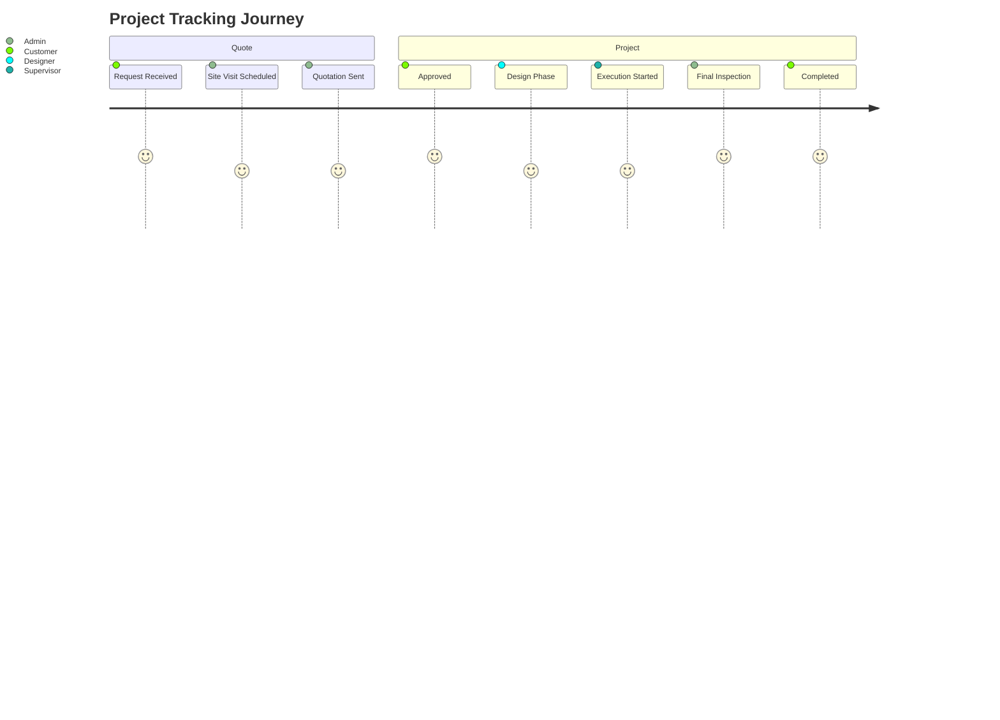
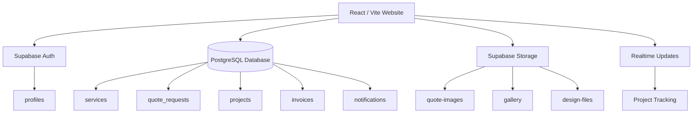
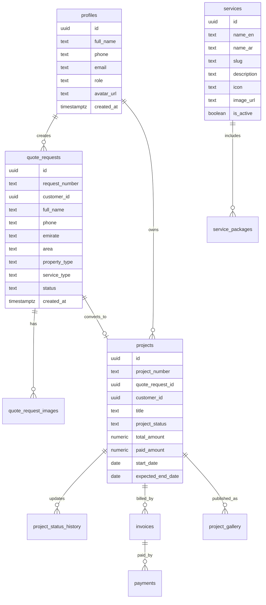

<!--
╔══════════════════════════════════════════════════════════════════════════════╗
║                                                                              ║
║        AL HANA AL ZAHABYAH — DESIGN & DECORATION WORKS README                ║
║        Ultra Luxury GitHub README prepared for a premium UAE design brand     ║
║        Prepared by Sadek Elgazar                                             ║
║                                                                              ║
╚══════════════════════════════════════════════════════════════════════════════╝
-->

<div align="center">


# 🟡 AL HANA AL ZAHABYAH  
## Design & Decoration Works

### Luxury Interior Design • Home Paint • Decoration • Renovation • UAE

<br/>


<br/>
<br/>

> **A premium digital platform for a UAE-based design and decoration company, built to present luxury services, capture quote requests, manage projects, showcase before/after transformations, and prepare the business for full Supabase-powered operations.**

<br/>

[🌐 Website](https://www.alhanaalzahabyah.com) •
[📩 Admin Email](mailto:admin@alhanaalzahabyah.com) •
[💬 WhatsApp](#-contact--social-channels) •
[📸 Gallery](#-projects-gallery-experience) •
[🧾 Request Quote](#-request-quote-system) •
[🛠 Admin Dashboard](#-admin-dashboard)

</div>

---

<div dir="rtl">

# ✦ نبذة فاخرة عن المشروع

**AL HANA AL ZAHABYAH — Design & Decoration Works** هي منصة رقمية احترافية مصممة لشركة تعمل في مجال **التصميم الداخلي، الدهانات، الديكور، وتجديد المنازل والمشاريع التجارية داخل الإمارات**.  
الهدف من هذا المشروع ليس إنشاء موقع تعريفي عادي، بل بناء **واجهة رقمية فاخرة** تعكس جودة أعمال الشركة وتحوّل الزائر إلى عميل محتمل، ثم تسمح لاحقًا بإدارة الطلبات والمشاريع والفواتير عبر نظام متكامل مبني على **Supabase**.

هذا الريبو مخصص ليكون قاعدة بناء كاملة قابلة للربط مع GitHub، ثم التطوير التدريجي حتى يصبح الموقع فعالًا تشغيليًا بالكامل.

</div>

---

## ✨ Visual Identity

<div align="center">

<table>
<tr>
<td align="center" width="20%">
<h3>⚫ Deep Black</h3>
<code>#070707</code><br/>

</td>
<td align="center" width="20%">
<h3>⬛ Charcoal</h3>
<code>#151515</code><br/>

</td>
<td align="center" width="20%">
<h3>🟡 Luxury Gold</h3>
<code>#D4AF37</code><br/>

</td>
<td align="center" width="20%">
<h3>🟤 Bronze Gold</h3>
<code>#A97924</code><br/>

</td>
<td align="center" width="20%">
<h3>⚪ Ivory</h3>
<code>#F8F5ED</code><br/>

</td>
</tr>
</table>

</div>

<div dir="rtl">

### ✦ أسلوب التصميم المطلوب

| العنصر | التوجيه البصري |
|---|---|
| الهوية | فاخرة، سوداء وذهبية، راقية، مخصصة لشركة تصميم وديكور |
| الخطوط | عربية واضحة وفاخرة + إنجليزية نظيفة مثل Inter / Poppins / Playfair Display |
| الحركة | انتقالات ناعمة، ظهور تدريجي، Hover ذهبي، صور قبل/بعد |
| الخلفيات | Charcoal, marble texture, architectural line art, glass cards |
| الأزرار | ذهبية بتأثير Metallic / Glow بسيط |
| الصور | فلل، مجالس، صالات، غرف، مطابخ، قبل/بعد، مخططات هندسية |
| التجربة | سريعة، ثنائية اللغة، متجاوبة، مريحة، تدفع العميل لطلب عرض سعر |

</div>

---

# 🏛 Brand Statement

<div dir="rtl">

> **نحو مساحات تعكس رؤيتك.**  
> في الهنا الذهبية، نحول المنازل والفلل والمساحات التجارية إلى بيئات راقية تجمع بين الجمال، الراحة، جودة التنفيذ، والتفاصيل التي تصنع الفارق.

</div>

<div align="center">

```
╭────────────────────────────────────────────────────────────╮
│  DESIGN        •        DECORATION        •        RENOVATION │
│  Luxury Mood   •        Precise Finish    •        UAE Quality │
╰────────────────────────────────────────────────────────────╯
```

</div>

---

# 📌 Project Core Information

| Field | Details |
|---|---|
| **Company Name** | AL HANA AL ZAHABYAH |
| **Arabic Brand** | الهنا الذهبية للتصميم وأعمال الديكور |
| **Business Field** | Design & Decoration Works |
| **Country / Market** | United Arab Emirates |
| **Official Website** | `www.alhanaalzahabyah.com` |
| **Admin Email** | `admin@alhanaalzahabyah.com` |
| **Main Brand Colors** | Black, Charcoal, Luxury Gold, Bronze, Ivory |
| **Prepared By** | Sadek Elgazar |
| **Status** | Website build-ready, Supabase-ready, GitHub-ready |

---

# 🧭 Table of Contents

- [Core Services](#-core-services)
- [Website Pages](#-website-pages)
- [Customer Journey](#-customer-journey)
- [UI Experience](#-ui-experience)
- [Request Quote System](#-request-quote-system)
- [Project Tracking](#-project-tracking)
- [Admin Dashboard](#-admin-dashboard)
- [Supabase Architecture](#-supabase-architecture)
- [Database Schema](#-database-schema)
- [Storage Buckets](#-storage-buckets)
- [Folder Structure](#-folder-structure)
- [Tech Stack](#-tech-stack)
- [SEO Strategy](#-seo-strategy)
- [Social Channels](#-contact--social-channels)
- [Development Roadmap](#-development-roadmap)
- [Quality Checklist](#-quality-checklist)
- [Prepared By](#-prepared-by)

---

# 🛋 Core Services

<div align="center">

<table>
<tr>
<td align="center" width="25%">
<h2>🏠</h2>
<h3>Home Design</h3>
<p>Elegant residential interior concepts for villas, apartments, majlis rooms, bedrooms, kitchens, and full home layouts.</p>
</td>
<td align="center" width="25%">
<h2>🎨</h2>
<h3>Home Paint</h3>
<p>Premium wall finishing, decorative paint, exterior paint, accent walls, texture finishes, and refined color planning.</p>
</td>
<td align="center" width="25%">
<h2>🪞</h2>
<h3>Home Decoration</h3>
<p>Luxury decorative styling, gypsum works, lighting concepts, wall panels, curtains, furniture mood, and final detailing.</p>
</td>
<td align="center" width="25%">
<h2>🛠</h2>
<h3>Home Renovation</h3>
<p>Full home improvement, villa renovation, kitchen and bathroom upgrades, flooring, ceiling, lighting, and finishing works.</p>
</td>
</tr>
</table>

</div>

<div dir="rtl">

## خدمات موسعة داخل الموقع

| القسم | الخدمات |
|---|---|
| التصميم الداخلي | تصميم فلل، شقق، مجالس، غرف نوم، مكاتب، صالات |
| الدهانات | دهانات داخلية، خارجية، ديكورية، ورق جدران، Texture Paint |
| الديكور | جبس بورد، إضاءات، ألواح جدارية، ستائر، مرايا، إكسسوارات |
| التجديد | مطابخ، حمامات، أرضيات، أسقف، واجهات، تحسين شامل |
| المشاريع التجارية | مكاتب، محلات، مطاعم، صالونات، معارض |
| الاستشارات | زيارة موقع، قياس، اقتراحات، تصور مبدئي، عرض سعر |
| إدارة المشروع | متابعة مراحل التنفيذ، صور قبل/بعد، تقارير إنجاز |

</div>

---

# 🌐 Website Pages

<div dir="rtl">

الموقع يجب أن يكون غنيًا، منظمًا، فاخرًا، ومبنيًا على صفحات واضحة تقود العميل من مرحلة الانبهار إلى مرحلة طلب عرض السعر.

</div>

| Page | Route | Purpose | Key Sections |
|---|---|---|---|
| 🏛 Home | `/` | الصفحة الرئيسية الفاخرة | Hero, services, why us, gallery, CTA |
| 👑 About Us | `/about` | تعريف الشركة والرؤية | Story, mission, values, quality promise |
| 🛋 Services | `/services` | عرض كل الخدمات | Service cards, benefits, process |
| 🏠 Interior Design | `/services/interior-design` | تصميم داخلي | Residential/commercial, mood, packages |
| 🎨 Painting Services | `/services/painting` | دهانات وتشطيبات | Decorative paint, exterior, finishes |
| 🪞 Decoration Works | `/services/decoration` | ديكور | Gypsum, lighting, panels, styling |
| 🛠 Renovation | `/services/renovation` | تجديد كامل | Kitchen, bathroom, villa, apartment |
| 🏢 Commercial Projects | `/services/commercial` | مشاريع تجارية | Offices, shops, restaurants, salons |
| 🖼 Projects Gallery | `/gallery` | معرض الأعمال | Before/after, filters, categories |
| 🧾 Request Quote | `/request-quote` | طلب عرض سعر | Form, images upload, service selector |
| 📍 Track Project | `/track-project` | متابعة المشروع | Project number, progress, status |
| 👤 Customer Dashboard | `/customer` | لوحة العميل | Requests, projects, invoices |
| 🛠 Admin Dashboard | `/admin` | لوحة الإدارة | KPIs, requests, projects, invoices |
| 📩 Contact Us | `/contact` | التواصل | WhatsApp, email, map, form |
| ❔ FAQs | `/faqs` | أسئلة شائعة | Services, pricing, visits, timeline |
| 📄 Service Policy | `/policy` | سياسة الخدمة | Scope, approvals, payment, warranties |
| 📰 Blog / Tips | `/blog` | محتوى تسويقي | Design tips, renovation guides |

---

# 🎬 Homepage Experience

<div dir="rtl">

## Hero Section

**العنوان الرئيسي:**  
`نحو فضاءات تعكس رؤيتك`

**النص:**  
`تصميم وتنفيذ داخلي ومعماري فاخر للمنازل والفلل والمساحات التجارية داخل الإمارات، بجودة تنفيذ عالية وتفاصيل تليق بذوقك.`

**الأزرار:**
- `اطلب عرض سعر`
- `شاهد أعمالنا`
- `تواصل عبر واتساب`

</div>

```txt
┌─────────────────────────────────────────────────────────────────────┐
│  GOLD LOGO                                                           │
│                                                                     │
│  نحو فضاءات تعكس رؤيتك                                              │
│  تصميم وتنفيذ داخلي ومعماري فاخر داخل الإمارات                       │
│                                                                     │
│  [اطلب عرض سعر]   [شاهد أعمالنا]   [واتساب]                         │
│                                                                     │
│                           Modern Villa / Luxury Interior Visual      │
└─────────────────────────────────────────────────────────────────────┘
```

<div dir="rtl">

## أقسام الصفحة الرئيسية

1. **Hero فاخر** مع صورة فيلا أو صالة داخلية مضاءة.
2. **شريط ثقة** يعرض: جودة تنفيذ، التزام بالمواعيد، إشراف هندسي، تصميم مخصص.
3. **الخدمات الرئيسية** في Cards سوداء وذهبية.
4. **قبل / بعد** يعرض الفرق في المشاريع.
5. **كيف نعمل؟** خطوات من الاستشارة إلى التسليم.
6. **لماذا الهنا الذهبية؟** جودة، ذوق، متابعة، ثقة.
7. **معرض مختصر** لأعمال الشركة.
8. **طلب عرض سعر سريع**.
9. **آراء العملاء**.
10. **Footer فاخر** بكل روابط التواصل.

</div>

---

# 🧑‍💼 Customer Journey

```mermaid
flowchart LR
    A[Visitor opens website] --> B[Explores services]
    B --> C[Views gallery and before-after]
    C --> D[Clicks Request Quote]
    D --> E[Chooses service type]
    E --> F[Uploads site photos]
    F --> G[Schedules site visit]
    G --> H[Receives quotation]
    H --> I[Approves project]
    I --> J[Tracks progress]
    J --> K[Receives invoice]
    K --> L[Final delivery and review]
```



<div dir="rtl">

## رحلة العميل داخل النظام

| Step | Arabic | Description |
|---|---|---|
| 01 | استكشاف الخدمات | العميل يرى الخدمات بوضوح من الصفحة الرئيسية |
| 02 | اختيار الخدمة | يختار تصميم، دهانات، ديكور، أو تجديد |
| 03 | طلب عرض سعر | يملأ بياناته ويحدد الإمارة والمنطقة |
| 04 | رفع الصور | يرفع صور المكان المطلوب العمل عليه |
| 05 | تحديد المعاينة | يختار موعد زيارة أو ينتظر اتصال الإدارة |
| 06 | استلام العرض | يستلم عرض السعر بعد دراسة المتطلبات |
| 07 | بدء المشروع | يتحول الطلب إلى مشروع رسمي |
| 08 | متابعة التنفيذ | يرى الحالة والمراحل والصور |
| 09 | التسليم | يتم التسليم النهائي والفاتورة والتقييم |

</div>

---

# 🧾 Request Quote System

<div dir="rtl">

نموذج طلب عرض السعر يجب أن يكون من أهم أجزاء الموقع؛ لأنه نقطة التحويل الرئيسية.

## الحقول المطلوبة

| Field | Type | Notes |
|---|---|---|
| الاسم الكامل | Text | Required |
| رقم الهاتف | Phone | Required |
| البريد الإلكتروني | Email | Optional but recommended |
| الإمارة | Select | Dubai, Abu Dhabi, Sharjah, Ajman, RAK, Fujairah, UAQ |
| المنطقة | Text | Required |
| نوع العقار | Select | Villa, Apartment, Office, Shop, Restaurant, Salon |
| نوع الخدمة | Multi Select | Design, Paint, Decoration, Renovation |
| الميزانية التقريبية | Select | Optional |
| موعد المعاينة المفضل | Date | Optional |
| وصف المشروع | Textarea | Required |
| صور المكان | File Upload | Multiple images |
| الموافقة على التواصل | Checkbox | Required |

## بعد إرسال الطلب

- إنشاء رقم طلب تلقائي مثل: `HZ-2026-00001`
- إرسال إشعار للإدارة.
- عرض رسالة نجاح للعميل.
- إمكانية متابعة الطلب من صفحة Track Project.
- تخزين الصور داخل Supabase Storage لاحقًا.
- ربط الطلب بلوحة الإدارة.

</div>

---

# 📍 Project Tracking

<div dir="rtl">

صفحة تتبع المشروع تجعل الشركة تبدو منظمة ومحترفة جدًا. العميل يدخل رقم الطلب أو المشروع ويرى حالة التنفيذ.

</div>



<div dir="rtl">

## حالات التتبع

| Status | Arabic Display |
|---|---|
| `new` | تم استلام الطلب |
| `contacted` | تم التواصل مع العميل |
| `site_visit_scheduled` | تم تحديد موعد المعاينة |
| `site_visit_done` | تمت زيارة الموقع |
| `quote_preparing` | جاري إعداد عرض السعر |
| `quote_sent` | تم إرسال عرض السعر |
| `approved` | تم اعتماد المشروع |
| `design_phase` | مرحلة التصميم |
| `execution_started` | بدأ التنفيذ |
| `painting` | مرحلة الدهانات |
| `decoration` | مرحلة الديكور |
| `inspection` | المعاينة النهائية |
| `completed` | تم التسليم |

</div>

---

# 🛠 Admin Dashboard

<div dir="rtl">

لوحة الإدارة هي قلب التشغيل. يجب أن تكون فاخرة، بسيطة، عملية، وقادرة على إدارة الشركة يوميًا.

</div>

<div align="center">

<table>
<tr>
<td align="center"><h2>📥</h2><b>New Requests</b><br/>طلبات جديدة</td>
<td align="center"><h2>📅</h2><b>Appointments</b><br/>مواعيد ومعاينات</td>
<td align="center"><h2>🏗</h2><b>Projects</b><br/>مشاريع نشطة</td>
<td align="center"><h2>🧾</h2><b>Invoices</b><br/>فواتير ومدفوعات</td>
<td align="center"><h2>🖼</h2><b>Gallery</b><br/>معرض الأعمال</td>
</tr>
</table>

</div>

<div dir="rtl">

## أقسام لوحة الإدارة

| Section | Function |
|---|---|
| Overview | إحصائيات عامة، طلبات اليوم، المشاريع النشطة |
| Quote Requests | إدارة طلبات عرض السعر الجديدة |
| Appointments | جدولة زيارات الموقع والمعاينات |
| Projects | إنشاء مشاريع وتحديث حالاتها |
| Project Updates | رفع صور وتحديثات للمراحل |
| Gallery | رفع مشاريع قبل/بعد للعرض العام |
| Customers | إدارة العملاء وبيانات التواصل |
| Invoices | إنشاء فواتير ومتابعة المدفوعات |
| Team | إضافة مصممين ومشرفين وإداريين |
| Settings | معلومات الشركة، روابط التواصل، إعدادات الموقع |

</div>

---

# 🏗 Supabase Architecture



<div dir="rtl">

## الهدف من Supabase

- تخزين بيانات العملاء والطلبات.
- إدارة صور المكان وصور قبل/بعد.
- إنشاء مشروع بعد موافقة العميل.
- تحديث مراحل التنفيذ.
- تجهيز نظام إشعارات.
- بناء لوحة تحكم للإدارة.
- تجهيز المشروع للتوسع مستقبلاً.

</div>

---

# 🧬 Database Schema



---

## 🧱 Main Tables

<details>
<summary><b>01 — profiles</b></summary>

```sql
create table profiles (
  id uuid primary key references auth.users(id) on delete cascade,
  full_name text,
  phone text,
  email text,
  role text check (role in ('customer', 'admin', 'designer', 'supervisor', 'accountant')) default 'customer',
  avatar_url text,
  created_at timestamptz default now(),
  updated_at timestamptz default now()
);
```

</details>

<details>
<summary><b>02 — services</b></summary>

```sql
create table services (
  id uuid primary key default gen_random_uuid(),
  name_en text not null,
  name_ar text not null,
  slug text unique not null,
  description_en text,
  description_ar text,
  icon text,
  image_url text,
  is_active boolean default true,
  sort_order int default 0,
  created_at timestamptz default now()
);
```

</details>

<details>
<summary><b>03 — quote_requests</b></summary>

```sql
create table quote_requests (
  id uuid primary key default gen_random_uuid(),
  request_number text unique not null,
  customer_id uuid references profiles(id),
  full_name text not null,
  phone text not null,
  email text,
  emirate text not null,
  area text not null,
  property_type text,
  service_type text not null,
  budget_range text,
  preferred_date date,
  project_description text not null,
  status text default 'new',
  assigned_to uuid references profiles(id),
  created_at timestamptz default now(),
  updated_at timestamptz default now()
);
```

</details>

<details>
<summary><b>04 — projects</b></summary>

```sql
create table projects (
  id uuid primary key default gen_random_uuid(),
  project_number text unique not null,
  quote_request_id uuid references quote_requests(id),
  customer_id uuid references profiles(id),
  title text not null,
  service_type text,
  emirate text,
  area text,
  project_status text default 'pending',
  start_date date,
  expected_end_date date,
  actual_end_date date,
  total_amount numeric default 0,
  paid_amount numeric default 0,
  remaining_amount numeric generated always as (total_amount - paid_amount) stored,
  assigned_designer uuid references profiles(id),
  assigned_supervisor uuid references profiles(id),
  created_at timestamptz default now(),
  updated_at timestamptz default now()
);
```

</details>

---

# 🗂 Storage Buckets

| Bucket | Purpose | Access |
|---|---|---|
| `avatars` | صور المستخدمين | User / Admin |
| `quote-images` | صور العميل عند طلب السعر | Customer / Admin |
| `project-before` | صور قبل التنفيذ | Admin / Supervisor |
| `project-after` | صور بعد التنفيذ | Admin / Supervisor |
| `project-updates` | صور مراحل التنفيذ | Admin / Supervisor / Customer read |
| `gallery` | صور معرض الأعمال | Public read / Admin write |
| `invoices` | فواتير PDF | Customer / Admin |
| `design-files` | ملفات تصميم، PDF، 3D، CAD | Admin / Designer |

---

# 🧩 UI Experience

<div dir="rtl">

## معايير الواجهة

| Area | Requirement |
|---|---|
| Header | شفاف عند البداية، يتحول لخلفية داكنة عند التمرير |
| Navigation | Home, About, Services, Gallery, Quote, Track, Contact |
| CTA | زر ذهبي واضح: Request Quote / اطلب عرض سعر |
| Footer | فاخر، غني، يحتوي على كل بيانات الشركة |
| Cards | زجاجية داكنة بإطار ذهبي خفيف |
| Gallery | فلترة + Before/After slider |
| Mobile | تصميم فاخر جدًا وليس نسخة مصغرة فقط |
| Arabic | RTL كامل ومحترف |
| English | LTR كامل ومتوازن |
| Animation | Framer Motion، دخول ناعم، Hover راقٍ |

</div>

---

# 🦶 Footer Design

<div dir="rtl">

الفوتر لا يجب أن يكون تقليديًا. يجب أن يكون نهاية فاخرة للموقع وكأنه بطاقة تعريف كاملة.

## محتوى الفوتر

- شعار الشركة.
- نبذة قصيرة.
- روابط الصفحات.
- روابط الخدمات.
- معلومات التواصل.
- روابط السوشيال ميديا.
- زر واتساب.
- حقوق الملكية.
- توقيع التصميم: `Designed & Developed by Sadek Elgazar`.

</div>

```txt
┌─────────────────────────────────────────────────────────────────────────────┐
│ LOGO                                                                        │
│ AL HANA AL ZAHABYAH                                                         │
│ Luxury Design & Decoration Works                                            │
│                                                                             │
│ Pages                  Services                  Contact                     │
│ Home                   Interior Design           admin@alhanaalzahabyah.com  │
│ About                  Painting                  www.alhanaalzahabyah.com    │
│ Services               Decoration                WhatsApp                    │
│ Gallery                Renovation                UAE                         │
│ Request Quote          Commercial                                                │
│                                                                             │
│ Instagram • Facebook • TikTok • LinkedIn • X • Threads • Snapchat            │
│ © 2026 AL HANA AL ZAHABYAH. Designed by Sadek Elgazar.                       │
└─────────────────────────────────────────────────────────────────────────────┘
```

---

# 📣 Contact & Social Channels

| Channel | Handle / URL |
|---|---|
| 🌐 Website | `www.alhanaalzahabyah.com` |
| 📩 Admin Email | `admin@alhanaalzahabyah.com` |
| 📧 Info Email | `info@alhanaalzahabyah.com` |
| 🧾 Sales Email | `sales@alhanaalzahabyah.com` |
| 🛠 Support Email | `support@alhanaalzahabyah.com` |
| 📸 Instagram | `@alhanaalzahabyah` |
| 🎵 TikTok | `@alhanaalzahabyah` |
| 👍 Facebook | `facebook.com/alhanaalzahabyah` |
| 💼 LinkedIn | `linkedin.com/company/al-hana-al-zahabyah` |
| ✕ X / Twitter | `@alhanaalzahabyah` |
| 👻 Snapchat | `@alhanaalzahabyah` |
| 🧵 Threads | `@alhanaalzahabyah` |
| 📌 Pinterest | `pinterest.com/alhanaalzahabyah` |

---

# 🧪 Tech Stack

<div align="center">


</div>

| Layer | Recommended Tools |
|---|---|
| Frontend | React, Vite, TypeScript |
| Styling | Tailwind CSS, CSS variables |
| Animation | Framer Motion |
| Icons | Lucide React |
| Forms | React Hook Form + Zod |
| Backend | Supabase |
| Database | PostgreSQL |
| Auth | Supabase Auth |
| Storage | Supabase Storage |
| Deployment | Vercel / Netlify |
| Version Control | GitHub |

---

# 📁 Folder Structure

```bash
al-hana-al-zahabyah/
│
├── public/
│   ├── logo.png
│   ├── favicon.png
│   ├── og-image.jpg
│   └── images/
│       ├── hero/
│       ├── services/
│       ├── gallery/
│       └── icons/
│
├── src/
│   ├── app/
│   │   ├── App.tsx
│   │   └── routes.tsx
│   │
│   ├── components/
│   │   ├── common/
│   │   ├── layout/
│   │   ├── sections/
│   │   ├── forms/
│   │   ├── cards/
│   │   ├── dashboard/
│   │   └── gallery/
│   │
│   ├── pages/
│   │   ├── Home.tsx
│   │   ├── About.tsx
│   │   ├── Services.tsx
│   │   ├── ServiceDetails.tsx
│   │   ├── Gallery.tsx
│   │   ├── RequestQuote.tsx
│   │   ├── TrackProject.tsx
│   │   ├── Contact.tsx
│   │   ├── FAQs.tsx
│   │   ├── CustomerDashboard.tsx
│   │   └── AdminDashboard.tsx
│   │
│   ├── lib/
│   │   ├── supabase.ts
│   │   ├── constants.ts
│   │   ├── utils.ts
│   │   └── seo.ts
│   │
│   ├── data/
│   │   ├── services.ts
│   │   ├── pages.ts
│   │   ├── gallery.ts
│   │   └── faqs.ts
│   │
│   ├── hooks/
│   │   ├── useLanguage.ts
│   │   ├── useTheme.ts
│   │   └── useSupabase.ts
│   │
│   ├── types/
│   │   ├── service.ts
│   │   ├── quote.ts
│   │   ├── project.ts
│   │   └── user.ts
│   │
│   ├── styles/
│   │   ├── globals.css
│   │   └── theme.css
│   │
│   └── main.tsx
│
├── supabase/
│   ├── migrations/
│   ├── seed.sql
│   └── policies.sql
│
├── README.md
├── package.json
├── tailwind.config.ts
├── vite.config.ts
├── tsconfig.json
└── .env.example
```

---

# ⚙️ Environment Variables

```env
VITE_SUPABASE_URL=
VITE_SUPABASE_ANON_KEY=
VITE_SITE_URL=https://www.alhanaalzahabyah.com
VITE_ADMIN_EMAIL=admin@alhanaalzahabyah.com
VITE_WHATSAPP_NUMBER=
VITE_COMPANY_NAME=AL HANA AL ZAHABYAH
```

---

# 🚀 Installation

```bash
# Clone repository
git clone https://github.com/YOUR_USERNAME/al-hana-al-zahabyah.git

# Enter project
cd al-hana-al-zahabyah

# Install dependencies
npm install

# Run development server
npm run dev

# Build production
npm run build

# Preview production build
npm run preview
```

---

# 🔐 Roles & Permissions

| Role | Permissions |
|---|---|
| Customer | طلب عرض سعر، رفع صور، متابعة المشروع، رؤية الفواتير |
| Admin | إدارة كاملة لكل النظام |
| Designer | متابعة المشاريع المسندة ورفع تصاميم |
| Supervisor | تحديث مراحل التنفيذ ورفع صور الموقع |
| Accountant | إدارة الفواتير والمدفوعات |

---

# 🖼 Projects Gallery Experience

<div dir="rtl">

معرض الأعمال يجب أن يكون أقوى جزء بصري بعد الصفحة الرئيسية.

## مكونات المعرض

- فلترة حسب نوع المشروع.
- فلترة حسب الإمارة.
- صور قبل/بعد.
- Lightbox فاخر.
- تفاصيل مختصرة لكل مشروع.
- زر طلب خدمة مشابهة.
- تصميم مخصص للموبايل.

</div>

```txt
╔═══════════════════════ PROJECT GALLERY ═══════════════════════╗
║  [All] [Villas] [Apartments] [Painting] [Decoration] [Renovation]  ║
║                                                                    ║
║  ┌──────────────┐  ┌──────────────┐  ┌──────────────┐              ║
║  │ Before/After │  │ Villa Design │  │ Majlis Decor │              ║
║  └──────────────┘  └──────────────┘  └──────────────┘              ║
║                                                                    ║
║  Each project becomes a sales asset.                               ║
╚════════════════════════════════════════════════════════════════════╝
```

---

# 🔍 SEO Strategy

<div dir="rtl">

## كلمات مفتاحية مقترحة

- شركة تصميم داخلي في الإمارات
- ديكور منازل الإمارات
- تجديد فلل دبي
- دهانات منازل أبوظبي
- تصميم مجالس فاخرة
- شركة ديكور في دبي
- تصميم داخلي فلل الإمارات
- أعمال جبس بورد الإمارات
- تجديد شقق وفلل
- Home renovation UAE
- Interior design UAE
- Villa decoration Dubai
- Luxury interior design Abu Dhabi

## صفحات SEO مهمة

| Page | SEO Title |
|---|---|
| Home | Luxury Design & Decoration Works in UAE |
| Interior Design | Interior Design Services for Villas & Homes in UAE |
| Painting | Premium Home Painting Services in UAE |
| Decoration | Home Decoration & Gypsum Works in UAE |
| Renovation | Villa & Apartment Renovation in UAE |
| Gallery | Before & After Interior Design Projects |
| Contact | Contact AL HANA AL ZAHABYAH |

</div>

---

# 🧭 Development Roadmap


<div dir="rtl">

## مراحل التنفيذ العملية

| المرحلة | الوصف |
|---|---|
| 01 | تثبيت الهوية، اللوجو، الألوان، الصفحات، المحتوى |
| 02 | بناء واجهة الموقع الفاخرة |
| 03 | إنشاء صفحات الخدمات والمعرض |
| 04 | بناء نموذج طلب عرض السعر |
| 05 | تجهيز Supabase وقاعدة البيانات |
| 06 | بناء لوحة الإدارة ولوحة العميل |
| 07 | اختبار الموبايل واللغة والسرعة |
| 08 | الربط مع GitHub والنشر |
| 09 | إدخال بيانات الشركة الحقيقية |
| 10 | إطلاق النسخة النهائية |

</div>

---

# 🧿 Microcopy Examples

<div dir="rtl">

## أزرار الموقع

- `اطلب عرض سعر`
- `شاهد أعمالنا`
- `ابدأ مشروعك الآن`
- `احجز معاينة`
- `تواصل عبر واتساب`
- `اكتشف خدماتنا`
- `تابع مشروعك`

## عبارات ثقة

- `جودة تنفيذ تليق بذوقك`
- `تصميم يعكس شخصيتك`
- `من الفكرة إلى التسليم`
- `تفاصيل تصنع الفخامة`
- `نحو فضاءات تعكس رؤيتك`
- `تنفيذ منظم، متابعة واضحة، وتسليم احترافي`

</div>

---

# ✅ Quality Checklist

<div dir="rtl">

قبل النشر النهائي يجب التأكد من الآتي:

</div>

- [ ] Logo appears clearly in header, footer, favicon, and OG image.
- [ ] Website is fully responsive on mobile, tablet, and desktop.
- [ ] Arabic RTL and English LTR work properly.
- [ ] Request Quote form validates all required fields.
- [ ] Image upload is ready for Supabase Storage.
- [ ] Admin dashboard route is protected.
- [ ] Customer tracking page works with project/request number.
- [ ] Footer contains all business and social links.
- [ ] Gallery supports categories and before/after visuals.
- [ ] SEO metadata exists for all major pages.
- [ ] Website performance is optimized.
- [ ] All buttons have clear hover states.
- [ ] No placeholder content remains before launch.
- [ ] GitHub README is complete and professional.

---

# 🏆 Final Product Vision

<div align="center">

```
╔══════════════════════════════════════════════════════════════════════╗
║                                                                      ║
║   AL HANA AL ZAHABYAH will not be just a website.                    ║
║   It will be a premium digital showroom, quote engine, project        ║
║   management gateway, and visual trust builder for UAE clients.       ║
║                                                                      ║
╚══════════════════════════════════════════════════════════════════════╝
```

</div>

<div dir="rtl">

**الرؤية النهائية:**  
أن يظهر العميل أمام زواره بصورة شركة تصميم وديكور فاخرة، منظمة، قوية، ومقنعة، وأن يمتلك نظامًا رقميًا قابلًا للتوسع، يبدأ بموقع ويب احترافي وينتهي بمنصة تشغيل كاملة.

</div>

---

# 👤 Prepared By

<div align="center">

## Sadek Elgazar  
### Digital Design • Website Planning • Supabase Architecture • Brand Presentation


<br/>
<br/>

**© 2026 AL HANA AL ZAHABYAH — Design & Decoration Works**  
**Website:** `www.alhanaalzahabyah.com`  
**Admin:** `admin@alhanaalzahabyah.com`

</div>

---

<div align="center">

### ✦ Ready to Build ✦  
**Luxury Black & Gold Digital Platform for Design & Decoration Works**

</div>
