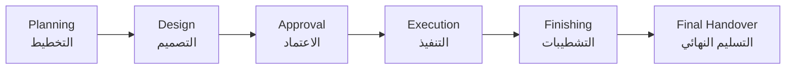
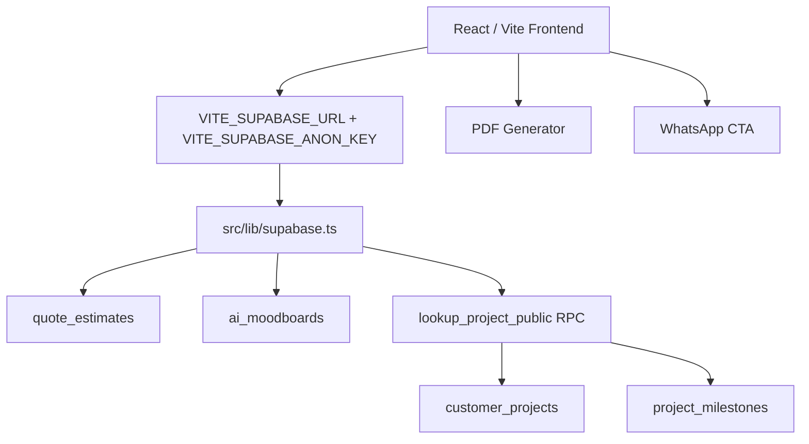

<div align="center">


# ✨ AL HANA AL ZAHABYAH ✨
## الهنا الذهبية للتصميم وأعمال الديكور

### **Luxury Interior Design • Decoration Works • Smart Digital Experience**


<br/><br/>

> **Premium UAE-focused interior design and decoration website with cinematic black-and-gold identity, Supabase data architecture, AI-style moodboard generation, project tracking, quote estimation, customer portal, and PDF summary export.**

<br/>

<a href="https://www.alhanaalzahabyah.com">
  
</a>
<a href="https://wa.me/971555587699">
  
</a>

</div>

---

## 🏛️ Luxury Visual Showcase

<div align="center">

<table>
<tr>
<td width="50%" align="center">

<br/><b>Luxury Lounge Hero</b><br/>
<sub>Homepage • Interior Design • Brand Atmosphere</sub>
</td>
<td width="50%" align="center">

<br/><b>Arabian Majlis Interior</b><br/>
<sub>Majlis • Decoration • UAE Luxury</sub>
</td>
</tr>
<tr>
<td width="50%" align="center">

<br/><b>AI Design Assistant</b><br/>
<sub>Smart Moodboard • AI Design Direction</sub>
</td>
<td width="50%" align="center">

<br/><b>Design Moodboard / Materials</b><br/>
<sub>Materials • Colors • Premium Process</sub>
</td>
</tr>
</table>

</div>

---

## 📌 Project Overview

**AL HANA AL ZAHABYAH** is a premium website for a UAE-based interior design, decoration, painting, renovation, and fit-out company.  
The website acts as a luxury digital showroom and business conversion platform.

It combines:

- Cinematic **black & gold luxury visual system**
- Arabic/English-ready customer journey
- Real Supabase database integration
- AI-style moodboard generator
- Visual project tracking
- Quote and cost estimation widget
- Customer portal with branded PDF summary
- WhatsApp and social-ready conversion flow
- Professional GitHub-ready architecture

---

## 🖤 Brand Identity

<div align="center">

<table>
<tr>
<td align="center" width="25%"><h3>⚫ Deep Black</h3><code>#070707</code><br/><sub>Luxury base</sub></td>
<td align="center" width="25%"><h3>🟡 Luxury Gold</h3><code>#D4AF37</code><br/><sub>Main accent</sub></td>
<td align="center" width="25%"><h3>🥂 Warm Gold</h3><code>#F5C542</code><br/><sub>CTA glow</sub></td>
<td align="center" width="25%"><h3>🏛️ Ivory White</h3><code>#F8F5ED</code><br/><sub>Premium text</sub></td>
</tr>
</table>

</div>

---

## ✨ Core Website Experience

<div align="center">

<table>
<tr>
<td width="33%" align="center"><h3>🎞️ Cinematic Hero</h3><p>Luxury animated slider with premium visuals, CTA buttons, WhatsApp action, and service mapping.</p></td>
<td width="33%" align="center"><h3>🧠 AI Moodboard</h3><p>Generates palettes, materials, furniture direction, lighting notes, and inspiration cards.</p></td>
<td width="33%" align="center"><h3>📍 Project Tracking</h3><p>Supabase-powered lookup with progress percentage, milestones, and visual timeline.</p></td>
</tr>
<tr>
<td width="33%" align="center"><h3>💰 Cost Estimator</h3><p>One clean quote widget for area, service type, project type, finish level, and AED estimate.</p></td>
<td width="33%" align="center"><h3>📄 PDF Summary</h3><p>Customer portal exports branded project summaries using html2canvas and jsPDF.</p></td>
<td width="33%" align="center"><h3>📱 Social Ready</h3><p>Prepared for WhatsApp, Google Ads, Instagram, TikTok, Snapchat, and launch campaigns.</p></td>
</tr>
</table>

</div>

---

## 🧭 Pages & Routes

| Page | Route | Purpose |
|---|---:|---|
| 🏠 Home | `/` | Luxury homepage and cinematic hero slider |
| 👤 About | `/about` | Company profile and brand story |
| 🛠️ Services | `/services` | Main service overview |
| 🏛️ Service Details | `/services/:slug` | Dedicated service pages |
| 🖼️ Projects | `/projects` | Portfolio and project gallery direction |
| 🔁 Before / After | `/before-after` | Transformation conversion page |
| 💰 Request Quote | `/request-quote` | Quote form and cost estimator |
| 📍 Track Project | `/track-project` | Real Supabase project lookup |
| 🧠 AI Assistant | `/design-assistant` | AI-style moodboard generator |
| 📞 Contact | `/contact` | WhatsApp and contact conversion |
| ❓ FAQs | `/faqs` | Client education and objections handling |
| 📰 Blog | `/blog` | SEO and content hub |
| 🔐 Customer Portal | `/customer-portal` | Project summary and PDF download |
| 🧑‍💼 Admin Portal | `/admin-portal` | Future management area |

---

## 🧠 AI Style Generator

The **Design Assistant** page includes a premium AI-style moodboard generator.

### Inputs

- Keywords such as `Luxury Modern Gold`, `Classic Majlis Royal`, `Minimalist Beige`
- Room type such as Living Room, Bedroom, Majlis, Office, Bathroom, Kitchen

### Outputs

| Output | Description |
|---|---|
| Style Title | Suggested premium design direction |
| Color Palette | Visual color swatches |
| Materials | Marble, brass, wood, fabrics, textures |
| Furniture Notes | Layout and furnishing recommendation |
| Lighting Notes | Hidden LED, warm gold light, spotlights |
| Inspiration Cards | Moodboard-style creative prompts |
| Supabase Save | Stored in `ai_moodboards` |

---

## 📍 Visual Project Tracking



The project tracker reads real project data from Supabase using a secure RPC function instead of opening public table access.

### Supabase tables

| Table | Purpose |
|---|---|
| `customer_projects` | Customer project profile |
| `project_milestones` | Project lifecycle stages |
| `quote_estimates` | Quote estimation submissions |
| `ai_moodboards` | AI-style generated moodboards |

---

## 💰 Quote Estimator

The quote estimator combines quick estimation and cost estimation into **one clean widget**.

### Inputs

- Area / square footage
- Service type
- Project type
- Finish level

### Service examples

- Interior Design
- Decoration
- Painting
- Renovation
- Full Villa Design
- Majlis Design
- Fit-out / Execution

### Output

```txt
Estimated Low Range  → AED
Estimated High Range → AED
Disclaimer           → Final pricing depends on site visit, material selection, drawings, scope, and approval.
```

---

## 🗄️ Supabase Architecture



### Security Model

- No `service_role` key in frontend
- `.env.local` ignored from GitHub
- `.env.example` uses safe placeholders
- RLS enabled on Supabase tables
- Public quote insert allowed safely
- Project lookup handled through controlled RPC

---

## 📄 PDF Generator

Customer Portal includes a branded project summary PDF generator.

### Includes

- Company name
- Project title
- Customer name
- Project type
- Location
- Progress percentage
- Quote estimate
- Milestones
- Generated date
- Professional footer

### Technical implementation

- `jspdf`
- `html2canvas`
- Arabic-safe HTML snapshot rendering
- Black-and-gold premium layout

---

## 🧩 Tech Stack

<div align="center">


</div>

---

## 📁 Structure

```txt
AL-HANA-AL-ZAHABYAH/
├── src/
│   ├── components/
│   │   ├── AIStyleGenerator.tsx
│   │   ├── CostEstimator.tsx
│   │   ├── ProjectTimeline.tsx
│   │   ├── ScrollToTop.tsx
│   │   ├── common/
│   │   ├── hero/
│   │   ├── layout/
│   │   └── ui/
│   ├── context/
│   │   └── AppContext.tsx
│   ├── data/
│   │   ├── heroSlides.ts
│   │   └── translations.ts
│   ├── lib/
│   │   ├── constants.ts
│   │   └── supabase.ts
│   ├── pages/
│   │   ├── Home.tsx
│   │   ├── RequestQuote.tsx
│   │   ├── TrackProjectV2.tsx
│   │   ├── DesignAssistant.tsx
│   │   └── CustomerDashboard.tsx
│   ├── services/
│   │   ├── estimateService.ts
│   │   └── projectService.ts
│   ├── styles/
│   │   ├── hero-slider.css
│   │   └── final-polish.css
│   └── utils/
│       └── pdfGenerator.ts
├── supabase/
│   ├── migrations/
│   └── functions/
├── .env.example
├── package.json
└── README.md
```

---

## ⚙️ Environment Variables

Create `.env.local` locally:

```env
VITE_SUPABASE_URL=https://bhnnsnytnoryymyocvyv.supabase.co
VITE_SUPABASE_ANON_KEY=your-supabase-publishable-key
```

> Do not commit `.env.local` to GitHub.

Safe `.env.example`:

```env
VITE_SUPABASE_URL=https://your-project-ref.supabase.co
VITE_SUPABASE_ANON_KEY=your-supabase-publishable-key
```

---

## 🚀 Local Development

```bash
npm install
npm run lint
npm run build
npm run dev
```

Open:

```txt
http://127.0.0.1:3000
```

---

## 🧪 Test Checklist

| Feature | Test |
|---|---|
| Homepage | Open `/` and check cinematic hero |
| Language | Toggle Arabic / English |
| Request Quote | Open `/request-quote` and calculate estimate |
| Supabase Estimate | Check `quote_estimates` table |
| AI Assistant | Open `/design-assistant` and generate moodboard |
| Moodboard Save | Check `ai_moodboards` table |
| Project Tracker | Search by project ID or phone |
| PDF Download | Open `/customer-portal` and download PDF |
| Mobile | Test responsive navigation and CTA layout |
| Build | Run `npm run lint && npm run build` |

---

## 🎨 Premium Visual Assets Library

<div align="center">

<table>
<tr>
<td width="50%" align="center"><br/><b>01 — Luxury Lounge Hero</b><br/><sub>Homepage Hero • Interior Design • Main Brand Visual</sub></td>
<td width="50%" align="center"><br/><b>02 — Luxury Villa Exterior</b><br/><sub>Villa Renovation • Premium Exterior • Architectural Presence</sub></td>
</tr>
<tr>
<td width="50%" align="center"><br/><b>03 — Arabian Majlis Interior</b><br/><sub>Home Decoration • Majlis Design • Arabian Luxury</sub></td>
<td width="50%" align="center"><br/><b>04 — Luxury Bedroom</b><br/><sub>Home Design • Bedroom Design • Hotel-Inspired Mood</sub></td>
</tr>
<tr>
<td width="50%" align="center"><br/><b>05 — Luxury Kitchen & Dining</b><br/><sub>Home Renovation • Kitchen Upgrade • Dining Experience</sub></td>
<td width="50%" align="center"><br/><b>06 — Luxury Office / Reception</b><br/><sub>Commercial Decoration • Offices • Corporate Pages</sub></td>
</tr>
<tr>
<td width="50%" align="center"><br/><b>07 — Commercial Showroom / Boutique</b><br/><sub>Commercial Projects • Retail Design • Showroom Experience</sub></td>
<td width="50%" align="center"><br/><b>08 — Before / After Transformation</b><br/><sub>Before / After Page • Renovation Concept</sub></td>
</tr>
<tr>
<td width="50%" align="center"><br/><b>09 — AI Design Assistant</b><br/><sub>AI Design Assistant • Smart Planning</sub></td>
<td width="50%" align="center"><br/><b>10 — Design Moodboard / Materials</b><br/><sub>Materials • Moodboard • Design Process</sub></td>
</tr>
</table>

</div>

---

## 🌐 Contact & Digital Identity

| Channel | Value |
|---|---|
| Website | `https://www.alhanaalzahabyah.com` |
| Email | `admin@alhanaalzahabyah.com` |
| WhatsApp | `+971 55 558 7699` |
| Instagram | `@alhanaalzahabyah` |
| TikTok | `@alhanaalzahabyah` |
| Snapchat | `@alhanaalzahabyah` |
| Threads | `@alhanaalzahabyah` |
| Facebook | `facebook.com/alhanaalzahabyah` |
| LinkedIn | `linkedin.com/company/al-hana-al-zahabyah` |
| Pinterest | `pinterest.com/alhanaalzahabyah` |

---

## 🏁 Production Readiness

<div align="center">

<table>
<tr><td align="center">✅ Design System</td><td align="center">✅ Luxury UI</td><td align="center">✅ Responsive Pages</td></tr>
<tr><td align="center">✅ Supabase Tables</td><td align="center">✅ Project Tracker</td><td align="center">✅ Quote Estimator</td></tr>
<tr><td align="center">✅ AI Moodboard</td><td align="center">✅ PDF Generator</td><td align="center">✅ Social CTA</td></tr>
</table>

</div>

---

## 🔮 Next Enhancements

- Deploy Supabase Edge Function for future AI provider integration
- Add authenticated customer accounts
- Add admin CRUD for projects and milestones
- Add invoices and payment records
- Add Google Ads landing campaign tracking
- Add SEO blog content expansion
- Add performance chunk splitting for large JS bundles

---

<div align="center">

## 🖤 Crafted With Precision

**Prepared for:** AL HANA AL ZAHABYAH  
**Prepared by:** Eng. Sadek Elgazar — Knoux  
**Role:** Full-Stack Developer • AI Solutions Architect • UI/UX Implementation


### **AL HANA AL ZAHABYAH**
#### *Where luxury interiors become a digital experience.*

</div>
